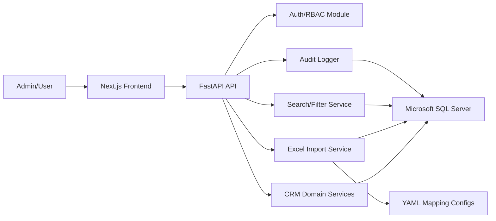

# Architecture

## Target Shape

The CRM is a modular web application:

- Frontend: Next.js / React.
- Backend: FastAPI.
- Database: Microsoft SQL Server for the local MVP.
- ORM and migrations: SQLAlchemy and Alembic.
- Local auth: JWT access tokens with password hashing.
- Future corporate auth: Microsoft Entra ID / Azure AD via OIDC.
- Local development: Python virtual environment plus a local SQL Server database.

## High-Level Components

## Backend Modules

| Module | Responsibility |
| --- | --- |
| `auth` | JWT authentication, password verification, role checks, future OIDC adapter boundary. |
| `users` | User accounts, roles, active status, admin management. |
| `organizations` | Startups, vendors, Borusan companies, network institutions. |
| `contacts` | People, emails, phone numbers, organization relationships. |
| `opportunities` | PoC and opportunity pipeline. |
| `events` | Ecosystem event library. |
| `tools` | AI tools library. |
| `notes` | Meeting notes, general notes, and follow-ups. |
| `imports` | Workbook upload, raw staging, normalization, preview, commit. |
| `vocabularies` | Statuses, categories, tags, geographies, organization types. |
| `branding` | Logo upload and active brand asset management. |
| `audit` | Append-only audit log. |

## Frontend Areas

| Area | Pages |
| --- | --- |
| Dashboard | Overview, pipeline summary, recent activity, import warnings. |
| Companies | Library, filters, detail page. |
| Opportunities | Pipeline board/list, detail page. |
| Events | Library, filters, event detail. |
| Network | Institution library, contacts, relationships. |
| AI Tools | Tool library and detail. |
| Admin | Users, roles, logo, vocabularies, imports, audit logs. |

## Organization Model Boundary

The MVP intentionally uses one `organizations` table for startups, vendors, Borusan companies, network institutions, and AI tool vendors because they share identity, contact, note, tag, source, audit, and search behavior.

The product must keep them separated by explicit type and UI scope:

- Company / Startup Library queries only `organization_type in ('STARTUP', 'VENDOR')`.
- Network Library queries only `organization_type = 'NETWORK_INSTITUTION'`.
- Borusan companies are internal reference records with `organization_type = 'BORUSAN_COMPANY'`; they power fit and opportunity relationships and should not appear in startup/vendor results.
- AI tools are records in `ai_tools`; their vendor can optionally link to an organization.
- `organization_subtype` handles light distinctions such as `VC`, `CVC`, `ACCELERATOR`, `COMMUNITY`, `PROGRAM`, and `AI_TOOL_VENDOR`.

This keeps shared CRM behavior in one place while preserving product separation through query scopes, navigation, and permissions.

## Data Boundary

The import boundary is strict:

1. Workbook data enters import staging tables first.
2. Raw cells and raw row JSON are preserved for traceability.
3. Normalizers generate candidate CRM records.
4. Validation warnings are attached to candidate rows.
5. Admin confirms the commit.
6. Only confirmed, normalized records are written to CRM domain tables.

This prevents spreadsheet inconsistencies from becoming database design.

## Search Strategy

MVP:

- SQL Server indexed filters for exact fields.
- SQL Server Full-Text Search can be enabled later for broad keyword matching. Until then, use indexed filters plus targeted contains queries for simple MVP search.
- Tag joins for vertical, technology, domain, event category, and expertise filters.
- Fuzzy organization/domain matching starts deterministically with normalized exact name/domain checks. SQL Server-specific fuzzy matching can be added later if needed.

Exact organization filters:

- `organization_type`
- `organization_subtype`
- `lifecycle_status_id`
- `geography_text` and later `country_codes`
- `source_text`
- `website_domain`
- Borusan company fit through `organization_borusan_fit.borusan_company_id`
- `fit_level`
- tag code / tag group through `organization_tags`
- `created_at`, `updated_at`, and `last_contact_date` once implemented

Opportunity filters:

- `stage`, which drives the pipeline UI
- optional `status_id` for secondary status/detail
- `opportunity_type`
- `borusan_company_id`
- `organization_id`
- `owner_user_id`
- `last_contact_date`
- follow-up due date/status through `follow_up_actions`

Event filters:

- `ai_program_relevance`
- `value_creation_potential`
- event tags
- `location_text` / geography
- `starts_on`, `ends_on`, and `date_text`
- participant role

Full-text search fields:

- Organization: `name`, `normalized_name`, `website_domain`, `solution_summary`, `source_text`, geography, tag labels, note bodies, and contact names/emails.
- Opportunity: title, topic, terms, value hypothesis, stage label, notes, organization name, and Borusan company.
- Event: name, area, category tags, location, comments, participant names/roles.
- Network: institution name, subtype, expertise tags, geography, relationship label, notes, contact emails.
- AI tools: tool name, category, solution summary, notes, linked vendor name.

Concrete example: "Find GenAI startups relevant for Borcelik"

The query should combine:

1. `organization_type in ('STARTUP', 'VENDOR')`
2. Borusan fit join where `borusan_company.code = 'BORCELIK'`
3. Text/tag search for `GenAI`, `Generative AI`, `AI Provider`, related tag aliases, solution summary, vertical, and notes
4. Optional exclusion of terminal negative statuses such as `NOT_A_FIT`, `POC_FAILED`, or `NOT_CONTINUING`
5. Sort by fit level, status recency, and text-rank

Future:

- Vector embeddings for semantic search.
- AI-assisted tagging and summarization.
- AI duplicate suggestions.
- Natural language search translated into filters.

The database schema reserves fields for future AI outputs, but AI features are not implemented in this stage.

## Deployment Direction

Local MVP:

- Local SQL Server database `BorusanAIEcosystemCRM`.
- FastAPI backend run through a Python virtual environment.
- Next.js frontend run directly with Node.js when frontend work resumes.
- Microsoft Entra ID SSO (the same as production; there is no local auth mode).
- Local file or database-backed logo storage.

Corporate deployment:

- SQL Server managed internally or Azure SQL, subject to Borusan infrastructure preference.
- Containerized backend/frontend.
- Entra ID OIDC authentication.
- Centralized secrets management.
- Blob/object storage for uploaded assets.
- Corporate logging and monitoring.

## Branding

The logo must be admin-configurable. The recommended model:

- `branding_assets` table stores metadata.
- Validate upload content type and extension. MVP allows PNG, JPEG, SVG, and WebP.
- Enforce a 2 MB default file size limit.
- Store files under generated safe names, never under user-provided filenames.
- Local MVP stores uploaded files in a mounted volume.
- Corporate deployment can switch storage to Azure Blob or internal object storage without changing UI behavior.
- Exactly one active logo per tenant/environment.
- Replacing the active logo writes an audit log entry and deactivates the previous logo in the same transaction.

## Auditability

All sensitive or business-critical actions should generate audit logs:

- Login success/failure.
- User and role changes.
- Logo changes.
- Import upload, preview, confirmation, rejection.
- Create/update/delete of companies, opportunities, contacts, events, tools, and notes.
- Status changes.
